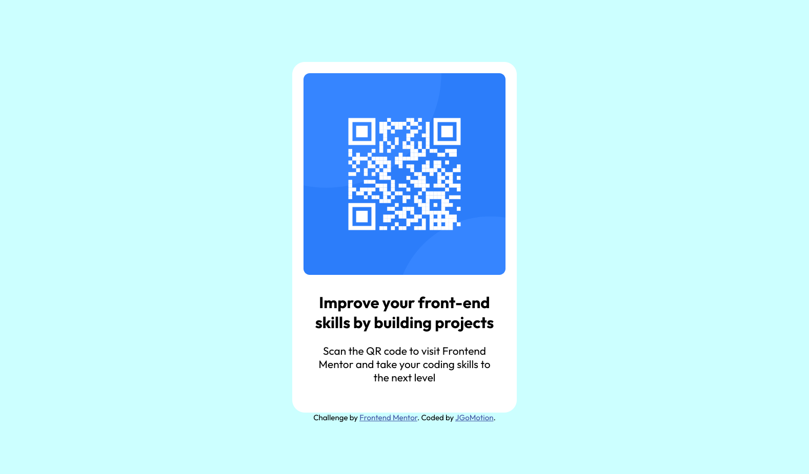

# Frontend Mentor - QR code component solution

This is a solution to the [QR code component challenge on Frontend Mentor](https://www.frontendmentor.io/challenges/qr-code-component-iux_sIO_H). Frontend Mentor challenges help you improve your coding skills by building realistic projects. 

## Table of contents

- [Overview](#overview)
  - [Screenshot](#screenshot)
  - [Links](#links)
- [My process](#my-process)
  - [Built with](#built-with)
  - [Continued development](#continued-development)
- [Author](#author)

## Overview
frontend learning through challenges.
### Screenshot

### Links
 
- Solution URL: https://github.com/JshJshSinger/QR-code-component-FEM
- Live Site URL: https://jshjshsinger.github.io/QR-code-component-FEM/

## My process

- write base html, divs, hierarchy
- mobile first, check for formatting changes in the desktop version
- update html
- add classes to markup
- start the css
- reset css defaults
- start styling, using classes as needed.
- check against reference, make adjustments, repeat.
- commit with a note, and push to github at notible stages.

### Built with

- Semantic HTML5 markup
- CSS custom properties
- Flexbox
- Mobile-first workflow

### Continued development
- streamlining css

## Author

- Website - [Josh](https://www.jgomotion.com)
- Frontend Mentor - [@JshjshSinger](https://www.frontendmentor.io/profile/JshJshSinger)
